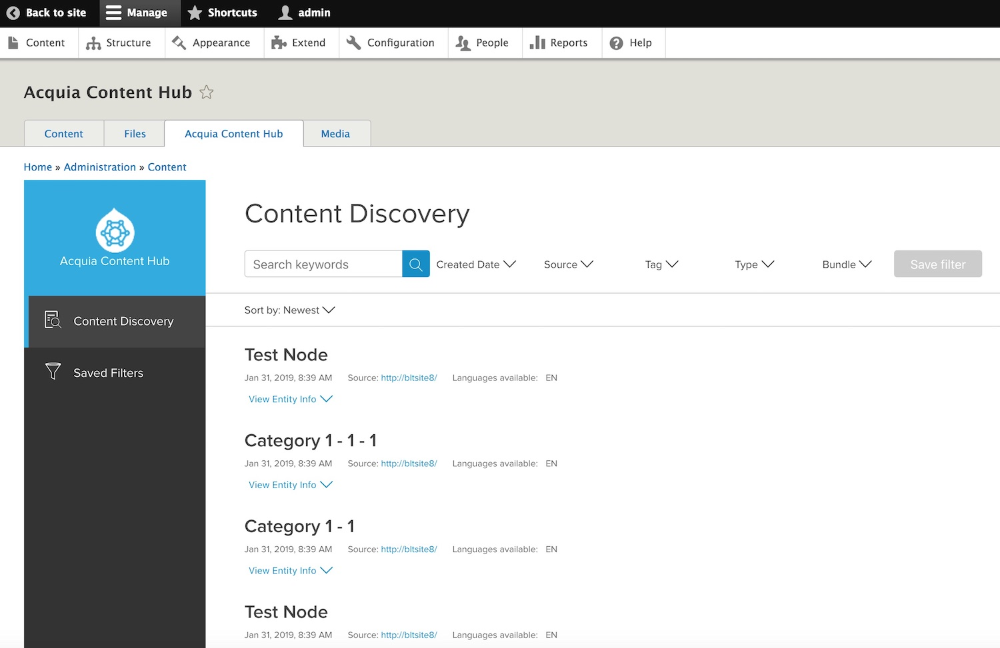

Managing Cloud Filters
======================

ContentHub sends all information about entities that have been published through webhooks. Webhooks are local endpoints in your sites that receive information coming from ContentHub.

Webhooks are registered at the same time a new client is registered to ContentHub. The information that flows from ContentHub to webhooks is controlled by Cloud Filters.

Cloud Filters are Elasticsearch queries that act as filters to content that are stored in the cloud and associated to a particular webhook. They restrict the information that is sent to webhooks according to their search results.

Multiple cloud filters can be associated to any particular webhook. The management of cloud filters and their associations to webhooks is controlled from the publisher site. This allows administrators to control the information flow to all the fleet of sites.

Start using Cloud Filters
^^^^^^^^^^^^^^^^^^^^^^^^^

Visit the ``Extend`` page within the Drupal administration interface and enable the ``Acquia ContentHub Curation`` module in your publisher site.

Then you can visit the discovery interface by clicking on ``Content`` and then ``Acquia ContentHub``. This will present you the Content Hub Discovery interface that will allow you to create filters for content that currently exists in ``Acquia ContentHub``.

|discovery_interface|

Create your first filter
^^^^^^^^^^^^^^^^^^^^^^^^

In the discovery interface, you can filter content by keywords, creation date, source client, tags, entity type and bundle.

Once you are satisfied with your filter selections, click on ``Save filter`` and set a name for this filter you have created. Take into account that saving a filter does not automatically start working, you have to assign it to a particular site (webhook) to restrict content to it.

When you click on ``Assign Sites`` you are presented with a list of sites to which webhooks are registered and you can assign this filter to multiple sites at once.

Multiple filters assigned to a site
^^^^^^^^^^^^^^^^^^^^^^^^^^^^^^^^^^^

Any site (or webhook) can have multiple filters assigned to it and it is necessary that content matches only one of those filters to be sent to the site.

Think of multiple filters assigned to a single site as the union of multiple subsets of content that will be sent to it.

Default Filter
^^^^^^^^^^^^^^

When a new client is registered to ContentHub together with a webhook registration, there is also a default filter created and assigned to this webhook. This default filter will just prevent any content to be sent to the site.

The default filter has a predefined name as **default_filter_<client name>** to allow us to distinguish it from other user created filters.

This global exclusion of content as the default filter is to prevent the site from receiving updates to all content being created by the publisher site and instead allow this site to be more selective about the content it is required to consume.

Content administrators would need to explicitly define specific filters on every site in order to allow them to receive content updates.

