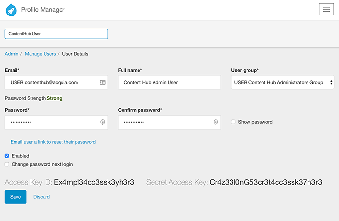

Obtaining ContentHub Service Credentials
========================================
Profile Manager is Acquia's service for managing Personalization and Syndication credentials. In order to get your credentials for ContentHub you must:

- `Sign in`_ to Profile Manager with an administrative account
- Click the **Admin** tab
- Click the **Manage Users** link in the first column, then on the subsequent page choose the **Content Hub Admin User**.
- Once on the **Content Hub Admin User** page for your account, you will find ``Access Key ID`` and ``Secret Access Key`` credentials. These are your ContentHub Credentials

|admin_user|

These are two of the three elements you will need to properly configure your ContentHub Service connection. They map as follows:
- ``Access Key ID`` » ``API Key``
- ``Secret Access Key`` » ``Secret Key``

The third and final element you will need from Acquia to configure your connection to the ContentHub Service is the Hostname. This should be decided based upon the region in which your site resides. Use the table below to make this decision.

+--------------+-----------------------------------------------+
| Region       | Acquia ContentHub Hostname                    |
+==============+===============================================+
| US East      | https://us-east-1.content-hub.acquia.com      |
+--------------+-----------------------------------------------+
| EU Central   | https://eu-central-1.content-hub.acquia.com   |
+--------------+-----------------------------------------------+
| AP SouthEast | https://ap-southeast-2.content-hub.acquia.com |
+--------------+-----------------------------------------------+

`Back to Installing ContentHub`_

.. _Sign in: https://docs.acquia.com/lift/profile-mgr#signing
.. _Back to Installing ContentHub: ../install.html