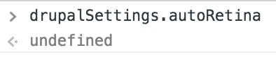
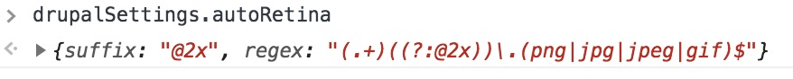

Test Case ID: js
Author: Aaron Klump
Created: February 28, 2019
---
## Test Scenario

The JS variables are present when the settings say so.

## Pre-Conditions

1. The [JS setting](/admin/config/media/image-styles/auto-retina) is disabled.

## Test Execution

1. Visit the [home page](/)
1. Open the JS browser console
1. Type `drupalSettings.autoRetina`
    - assert the property is `undefined` 
1. Visit the [settings page](/admin/config/media/image-styles/auto-retina)
1. Click on _Advanced_
1. Check _Include the javascript settings_
1. Save form
1. Visit the [home page](/)
1. Open the JS browser console
1. Type `drupalSettings.autoRetina`
    - assert you see the following value in the console 
1. Visit the [settings page](/admin/config/media/image-styles/auto-retina)
1. Click on _Advanced_
1. Uncheck _Include the javascript settings_
1. Save form
1. Visit the [home page](/)
1. Open the JS browser console
1. Type `drupalSettings.autoRetina`
    - assert the property is `undefined` 
