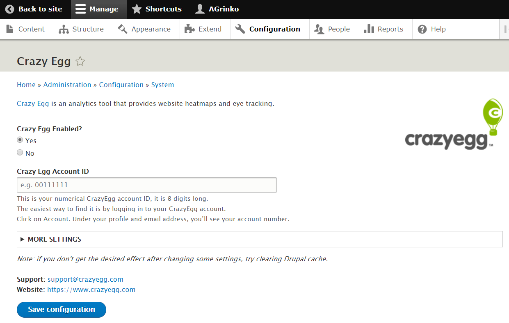
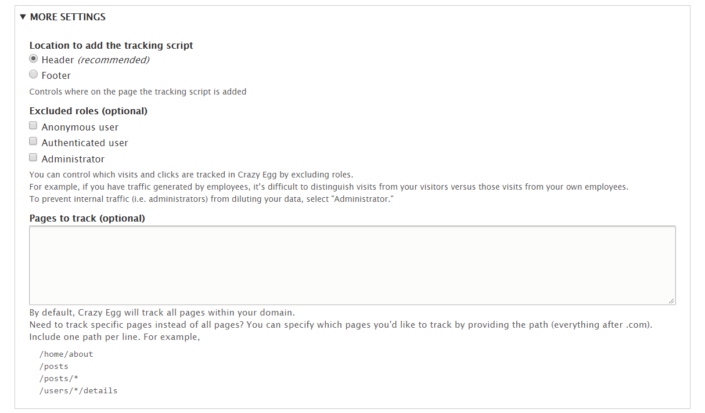

# Crazy Egg module for Drupal 8

This is developers documentation for maintaining the module.

## Overview

The module consists of 2 parts:
- admin interface to adjust module settings
- main business logic injecting Crazy Egg tracking script into the website pages for all visitors

Here is a screenshot of the admin interface:



The main part is the "Account ID" input field where user has to enter his Crazy Egg account number.
Based on the account number, tracking script URL is generated and injected into the website.

If invalid account number is entered, no script will be injected. If the number is valid, but belongs to a different
Crazy Egg user, the script will be injected but won't work because website domain name will not match any site
specified in the corresponding Crazy Egg account.

Besides that, there is "More Settings" section that provides additional features for advanced Drupal users:



## Tracking Script

The main job of the module is to insert Crazy Egg tracking script into the customer's website.

Currently it inserts the following HTML (for account number 00000011):

```html
<script src="//script.crazyegg.com/pages/scripts/0000/0011.js" async></script>
```

By convention, account number is split into 2 quartets used as the last pieces of the file path.
It is injected at the end of the `<head>` section by default, but can be injected at the end of `<body>` if "Footer" scope is selected.

_The script uses `async` attribute as it is recommended by Crazy Egg._

## Testing Module

For testing the module, create a Drupal 8 website on some hosting (e.g. Pantheon.io).
To install version of the module with all your local changes, pack all files in this repo into a ZIP or TAR.GZ archive with any name.
Then install the module from your Drupal website's admin interface by uploading this archive.

> To verify that the module is working correctly, it's enough to enter any valid account number in the input field (e.g. 00000011).
> Save changes and go to any page. Open Dev Tools => Elements tab, and search for "crazyegg" substring.
> It should reveal the script tag injected into the page with proper URL. It means plug-in is working fine!
> There's no need to check if data is actually tracked - it is a job of the Crazy Egg app itself.

With each set of changes, you have to uninstall the plug-in and repeat the process from the beginning.
Note that it might be tricky to delete this module in Drupal because just uninstalling it from the admin interface is not enough:
you'll also have to delete redundant files via SFTP (or Git). _There is a secret hook: the easiest way to delete files added/modified by the module
is to go to Pantheon site dev panel, switch from SFTP connection mode to Git and then switch back to SFTP. This will remove
all un-committed changes without need to use SFTP client_

In some cases you might notice that changes to the module configuration are not working (e.g. tracking script is still injected 
while it shouldn't be). Try clearing cache in this case: go to **Configuration** -> **Performance** and click on **Clear all caches**.
You might also want to disable caching for testing purposes by setting **Page cache maximum age** to "\<no caching\>".

## Files Structure

To understand how modules work in Drupal, refer to their documentation: https://www.drupal.org/docs/8/creating-custom-modules

In this section we can only briefly describe files structure of this module and the purpose of each file.

##### /crazyegg.info.yml

Metadata about the module

##### /crazyegg.links.menu.yml

Adds a link to Crazy Egg module settings on the `/admin/config` page for easier access to it.

##### /crazyegg.permissions.yml

Default settings allowing every site manager to administer all Crazy Egg module settings.

##### /crazyegg.routing.yml

Links to the custom files in module.

##### /config/install/crazyegg.settings.yml

Defines set of variables used by the module with their initial values.

##### /config/schema/crazyegg.schema.yml

Defines set of variables used by the module and maps them to specific data types.

##### /crazyegg.module

Main logic of the module. Implements several hooks that are invoked at different time during page loading and on different pages.

In particular, `crazyegg_library_info_build` function builds a tracking script with proper URL and defines it as a library.
`crazyegg_page_attachments` checks all conditions and injects that library into the page.
See inline comments for more details.

##### /src/Form/CrazyeggSettingsForm.php

This file describes module settings form in the admin interface. It lists all the settings input fields with their
descriptions.

Function `submitForm` explicitly reads all data entered in the input fields and sets new variables values accordingly
(by sending server requests). When adding/updating some variables, don't forget to update this function as well.

Function `buildForm` defines UI elements of the settings form.

## Collaboration

### Drupal versions

This module exists in 2 versions: for Drupal 7 and Drupal 8. This readme is slightly different for each version.

Currently there are 2 main branches in the repository (ignore `master` branch - we never use it):

- 7.x-1.x
- 8.x-1.x

The former is used for Drupal 7, the latter - for Drupal 8.
Both versions have similar UI but different files structure and code implementation because of significant changes
in API of the newer Drupal version.

If you want to introduce some changes only for one version, checkout the corresponding branch and push your changes there, e.g:

```bash
git checkout 8.x-1.x
```

When possible, try to perform the same changes in both versions to keep them as similar as possible in terms of UI and
functionality.

### Commits

When committing changes, make sure to give clear and descriptive name to your commit. Check `git log` to see examples
of previous commit names.

If commit is fixing some specific issue from Drupal.org raised by community, use the following commit name structure (example):

```text
Issue #123456 by username: Short issue title goes here
```

Get issue number and user name from issue details on drupal.org.

If you're applying a patch from some contributor, don't forget to mention it in commit name from a new line.
Example from real life:

```text
Issue #2746447 by richardcanoe: Add page specific crazyegg listing
Applied patch (with some modifications) by richardcanoe
``` 

### Releases

There are 2 kinds of releases in Drupal: stable and development.
Also, we have 2 versions of the module: for Drupal 7 and Drupal 8.
Hence, it's easy to get stuck when going to create a new release.

First, see Drupal documentation about creating releases: https://www.drupal.org/node/1068944

Also, there is a short summary of git commands you need to use for release (in the bottom): https://www.drupal.org/project/crazyegg/git-instructions

With each new stable release, increment minor version by 1 (e.g. v8.x-1.1, v8.x-1.2, v8.x-1.3, etc). It's hard to imagine
a case when major version should be updated since the module is not in active development anymore and only accepts maintenance fixes.

Don't forget to give a meaningful description to stable release listing all update notes.
See previous releases for example: https://www.drupal.org/project/crazyegg/releases

#### When to create stable release?

When there were lots of small updates in development branch and you think it's time to introduce them to the wide audience.

When there is some critical feature/fix that all new users must have.

Note that there will be lots of people using old version of our module, anyway.
It's not automatically updated. Only pepople who install the module for the first time (new Crazy Egg customers, usually) 
will have the latest version.

> Whenever there is a new stable release, Crazy Egg development team must know about it.
> There are several places where full URLs are used for downloading Drupal module (in Help center, in Install Wizard in-app),
> so when there is a new release, these URLs should be updated in Crazy Egg.

#### When to create dev release?

When there are some subtle changes like documentation or code style improvement, simple fixes that prevent some warnings in console.

First time, you have to manually create dev release for 7th or 8th version in module's admin page (see Drupal documentation). 
After dev release for certain branch is created, it is automatically updated whenever you push some changes to that branch.

Dev release is only used by people who understand what it means and want to give it a try - i.e. only a couple of advanced
Drupal users. So dev release is not suitable for changes that are implied for all Crazy Egg users right off.
