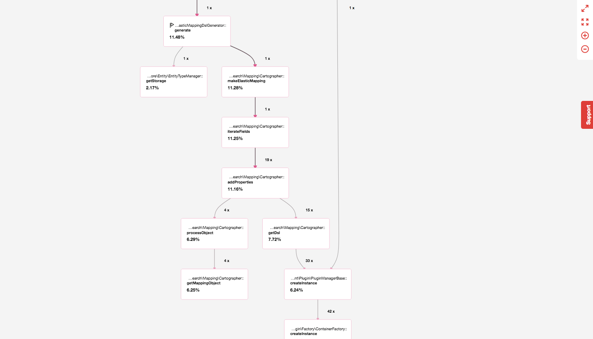

# Process

The

Let's take a look at a simple mapping example, an article with an entity reference to a node type 'Document', 'Document' in turn has a reference to a taxonomy 'category'

| Type     | Name     | Field    | Type             | Details                |
|:---------|:---------|:---------|:-----------------|:-----------------------|
| Node     | Article  |          |                  |                        |
|          |          | body     | long_text        |                        |
|          |          | document | entity_reference | type node:document     |
|          |          |          |                  |                        |
| Node     | Document |          |                  |                        |
|          |          | body     | long_text        |                        |
|          |          | document | entity_reference | type taxonomy:category |
|          |          |          |                  |                        |
| Taxonomy | Category |          |                  |                        |
|          |          | name     | text             |                        |

The mapping output for this with recursion set to 1 will look something like the following, with Document inlined and Category as a simple reference field

```
{
    "mappings": {
        "node__article": {
            "properties": {
                "nid": {
                    "boost": 0,
                    "coerce": true,
                    "doc_values": true,
                    "ignore_malformed": false,
                    "include_in_all": true,
                    "index": true,
                    "store": false,
                    "type": "integer"
                },
                "uuid": {
                    "boost": 0,
                    "doc_values": true,
                    "eager_global_ordinals": false,
                    "include_in_all": true,
                    "index": true,
                    "index_options": "docs",
                    "norms": false,
                    "similarity": "classic",
                    "store": false,
                    "type": "keyword"
                },
                "vid": {
                    "boost": 0,
                    "coerce": true,
                    "doc_values": true,
                    "ignore_malformed": false,
                    "include_in_all": true,
                    "index": true,
                    "store": false,
                    "type": "integer"
                },
                "langcode": {
                    "boost": 0,
                    "doc_values": true,
                    "eager_global_ordinals": false,
                    "include_in_all": true,
                    "index": true,
                    "index_options": "docs",
                    "norms": false,
                    "similarity": "classic",
                    "store": false,
                    "type": "keyword"
                },
                "type": {
                    "properties": []
                },
                "status": {
                    "boost": 0,
                    "doc_values": true,
                    "index": true,
                    "store": false,
                    "type": "boolean"
                },
                "title": {
                    "boost": 0,
                    "doc_values": true,
                    "eager_global_ordinals": false,
                    "include_in_all": true,
                    "index": true,
                    "index_options": "docs",
                    "norms": false,
                    "similarity": "classic",
                    "store": false,
                    "type": "keyword"
                },
                "uid": {
                    "properties": {
                        "uid": {
                            "type": "integer"
                        }
                    }
                },
                "created": {
                    "boost": 0,
                    "doc_values": true,
                    "format": "strict_date_optional_time||epoch_millis",
                    "ignore_malformed": true,
                    "include_in_all": true,
                    "index": true,
                    "null_value": "null_value",
                    "store": false,
                    "type": "date"
                },
                "changed": {
                    "boost": 0,
                    "doc_values": true,
                    "format": "strict_date_optional_time||epoch_millis",
                    "ignore_malformed": true,
                    "include_in_all": true,
                    "index": true,
                    "null_value": "null_value",
                    "store": false,
                    "type": "date"
                },
                "promote": {
                    "boost": 0,
                    "doc_values": true,
                    "index": true,
                    "store": false,
                    "type": "boolean"
                },
                "sticky": {
                    "boost": 0,
                    "doc_values": true,
                    "index": true,
                    "store": false,
                    "type": "boolean"
                },
                "revision_timestamp": {
                    "boost": 0,
                    "doc_values": true,
                    "format": "strict_date_optional_time||epoch_millis",
                    "ignore_malformed": true,
                    "include_in_all": true,
                    "index": true,
                    "null_value": "null_value",
                    "store": false,
                    "type": "date"
                },
                "revision_uid": {
                    "properties": {
                        "uid": {
                            "type": "integer"
                        }
                    }
                },
                "revision_log": {
                    "analyzer": "[elastic_search:language_derived_analyzer]",
                    "boost": 0,
                    "eager_global_ordinals": false,
                    "fielddata": false,
                    "include_in_all": true,
                    "index": true,
                    "index_options": "docs",
                    "norms": false,
                    "search_analyzer": "[elastic_search:language_derived_analyzer]",
                    "search_quote_analyzer": "[elastic_search:language_derived_analyzer]",
                    "similarity": "classic",
                    "store": false,
                    "term_vector": "no",
                    "type": "text"
                },
                "revision_translation_affected": {
                    "boost": 0,
                    "doc_values": true,
                    "index": true,
                    "store": false,
                    "type": "boolean"
                },
                "default_langcode": {
                    "boost": 0,
                    "doc_values": true,
                    "index": true,
                    "store": false,
                    "type": "boolean"
                },
                "body": {
                    "analyzer": "[elastic_search:language_derived_analyzer]",
                    "boost": 0,
                    "eager_global_ordinals": false,
                    "fielddata": false,
                    "include_in_all": true,
                    "index": true,
                    "index_options": "docs",
                    "norms": false,
                    "search_analyzer": "[elastic_search:language_derived_analyzer]",
                    "search_quote_analyzer": "[elastic_search:language_derived_analyzer]",
                    "similarity": "classic",
                    "store": false,
                    "term_vector": "no",
                    "type": "text"
                },
                "field_document": {
                    "properties": {
                        "nid": {
                            "boost": 0,
                            "coerce": true,
                            "doc_values": true,
                            "ignore_malformed": false,
                            "include_in_all": true,
                            "index": true,
                            "store": false,
                            "type": "integer"
                        },
                        "uuid": {
                            "boost": 0,
                            "doc_values": true,
                            "eager_global_ordinals": false,
                            "include_in_all": true,
                            "index": true,
                            "index_options": "docs",
                            "norms": false,
                            "similarity": "classic",
                            "store": false,
                            "type": "keyword"
                        },
                        "vid": {
                            "boost": 0,
                            "coerce": true,
                            "doc_values": true,
                            "ignore_malformed": false,
                            "include_in_all": true,
                            "index": true,
                            "store": false,
                            "type": "integer"
                        },
                        "langcode": {
                            "boost": 0,
                            "doc_values": true,
                            "eager_global_ordinals": false,
                            "include_in_all": true,
                            "index": true,
                            "index_options": "docs",
                            "norms": false,
                            "similarity": "classic",
                            "store": false,
                            "type": "keyword"
                        },
                        "type": {
                            "type": "keyword",
                            "boost": 0,
                            "doc_values": true,
                            "eager_global_ordinals": false,
                            "include_in_all": true,
                            "index": true,
                            "index_options": "docs",
                            "norms": false,
                            "similarity": "classic",
                            "store": false
                        },
                        "status": {
                            "boost": 0,
                            "doc_values": true,
                            "index": true,
                            "store": false,
                            "type": "boolean"
                        },
                        "title": {
                            "boost": 0,
                            "doc_values": true,
                            "eager_global_ordinals": false,
                            "include_in_all": true,
                            "index": true,
                            "index_options": "docs",
                            "norms": false,
                            "similarity": "classic",
                            "store": false,
                            "type": "keyword"
                        },
                        "uid": {
                            "type": "keyword",
                            "boost": 0,
                            "doc_values": true,
                            "eager_global_ordinals": false,
                            "include_in_all": true,
                            "index": true,
                            "index_options": "docs",
                            "norms": false,
                            "similarity": "classic",
                            "store": false
                        },
                        "created": {
                            "boost": 0,
                            "doc_values": true,
                            "format": "strict_date_optional_time||epoch_millis",
                            "ignore_malformed": true,
                            "include_in_all": true,
                            "index": true,
                            "null_value": "null_value",
                            "store": false,
                            "type": "date"
                        },
                        "changed": {
                            "boost": 0,
                            "doc_values": true,
                            "format": "strict_date_optional_time||epoch_millis",
                            "ignore_malformed": true,
                            "include_in_all": true,
                            "index": true,
                            "null_value": "null_value",
                            "store": false,
                            "type": "date"
                        },
                        "promote": {
                            "boost": 0,
                            "doc_values": true,
                            "index": true,
                            "store": false,
                            "type": "boolean"
                        },
                        "sticky": {
                            "boost": 0,
                            "doc_values": true,
                            "index": true,
                            "store": false,
                            "type": "boolean"
                        },
                        "revision_timestamp": {
                            "boost": 0,
                            "doc_values": true,
                            "format": "strict_date_optional_time||epoch_millis",
                            "ignore_malformed": true,
                            "include_in_all": true,
                            "index": true,
                            "null_value": "null_value",
                            "store": false,
                            "type": "date"
                        },
                        "revision_uid": {
                            "type": "keyword",
                            "boost": 0,
                            "doc_values": true,
                            "eager_global_ordinals": false,
                            "include_in_all": true,
                            "index": true,
                            "index_options": "docs",
                            "norms": false,
                            "similarity": "classic",
                            "store": false
                        },
                        "revision_log": {
                            "analyzer": "[elastic_search:language_derived_analyzer]",
                            "boost": 0,
                            "eager_global_ordinals": false,
                            "fielddata": false,
                            "include_in_all": true,
                            "index": true,
                            "index_options": "docs",
                            "norms": false,
                            "search_analyzer": "[elastic_search:language_derived_analyzer]",
                            "search_quote_analyzer": "[elastic_search:language_derived_analyzer]",
                            "similarity": "classic",
                            "store": false,
                            "term_vector": "no",
                            "type": "text"
                        },
                        "revision_translation_affected": {
                            "boost": 0,
                            "doc_values": true,
                            "index": true,
                            "store": false,
                            "type": "boolean"
                        },
                        "default_langcode": {
                            "boost": 0,
                            "doc_values": true,
                            "index": true,
                            "store": false,
                            "type": "boolean"
                        },
                        "body": {
                            "analyzer": "[elastic_search:language_derived_analyzer]",
                            "boost": 0,
                            "eager_global_ordinals": false,
                            "fielddata": false,
                            "include_in_all": true,
                            "index": true,
                            "index_options": "docs",
                            "norms": false,
                            "search_analyzer": "[elastic_search:language_derived_analyzer]",
                            "search_quote_analyzer": "[elastic_search:language_derived_analyzer]",
                            "similarity": "classic",
                            "store": false,
                            "term_vector": "no",
                            "type": "text"
                        },
                        "field_category": {
                            "type": "keyword",
                            "boost": 0,
                            "doc_values": true,
                            "eager_global_ordinals": false,
                            "include_in_all": true,
                            "index": true,
                            "index_options": "docs",
                            "norms": false,
                            "similarity": "classic",
                            "store": false
                        }
                    }
                }
            }
        }
    }
}
```
Note that if the recursion depth is increased to 2 then field_category will also be inlined

```
"field_category": {
    "type": "nested",
    "properties": {
        "name": {
            "boost": 0,
            "doc_values": true,
            "eager_global_ordinals": false,
            "include_in_all": true,
            "index": true,
            "index_options": "docs",
            "norms": false,
            "similarity": "classic",
            "store": false,
            "type": "keyword"
        },
        "description": {
            "analyzer": "[elastic_search:language_derived_analyzer]",
            "boost": 0,
            "eager_global_ordinals": false,
            "fielddata": false,
            "include_in_all": true,
            "index": true,
            "index_options": "docs",
            "norms": false,
            "search_analyzer": "[elastic_search:language_derived_analyzer]",
            "search_quote_analyzer": "[elastic_search:language_derived_analyzer]",
            "similarity": "classic",
            "store": false,
            "term_vector": "no",
            "type": "text"
        }
    }
}
```

You can see that there are many additional fields here, as well as the fields we added directly to our content type.
If you wish to disable these fields you should either set their mapping to none or exclude them entirely by implementing an EntityTypeDefinition Plugin
(see [Entity Type Definitions](./EntityTypeDefinitions.md) for more).

Looking at a call graph for this (recursion 2) you get the following



Language analyzers will be resolved at map push time and will be based on the ElasticIndex entity language value