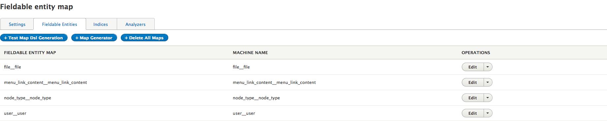
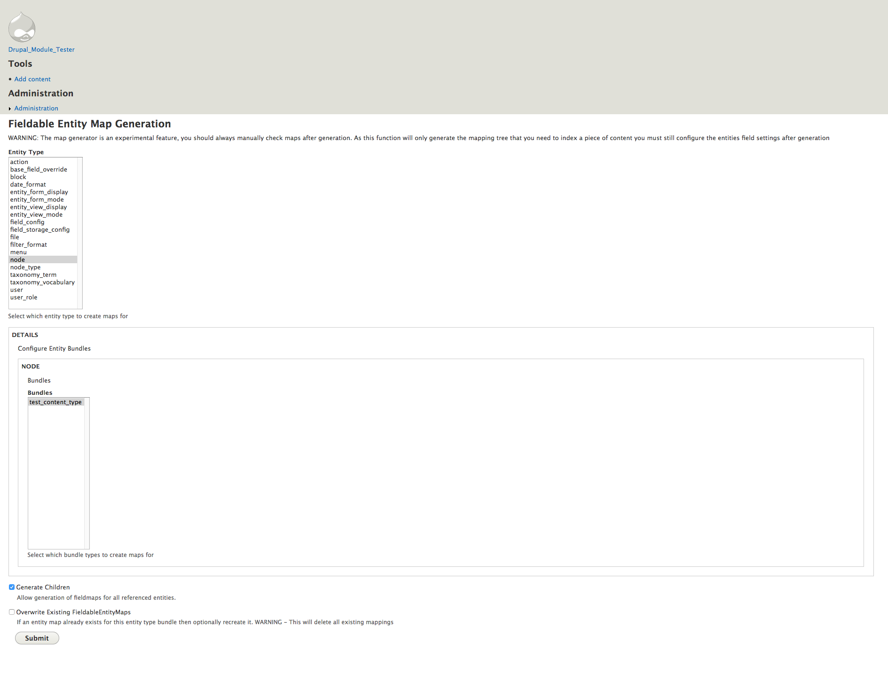
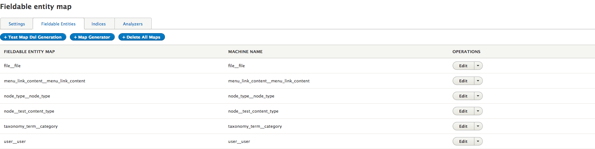
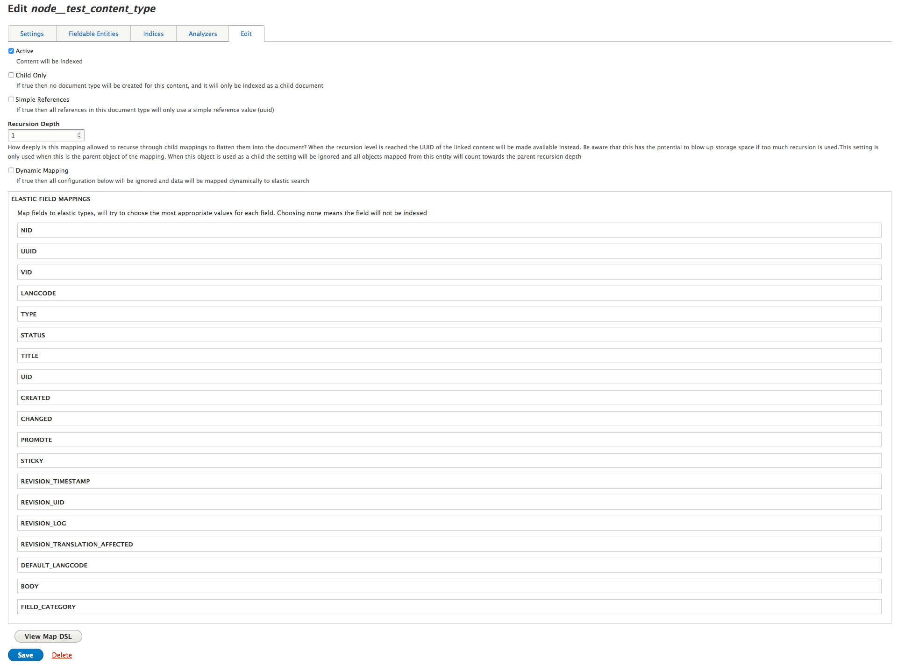
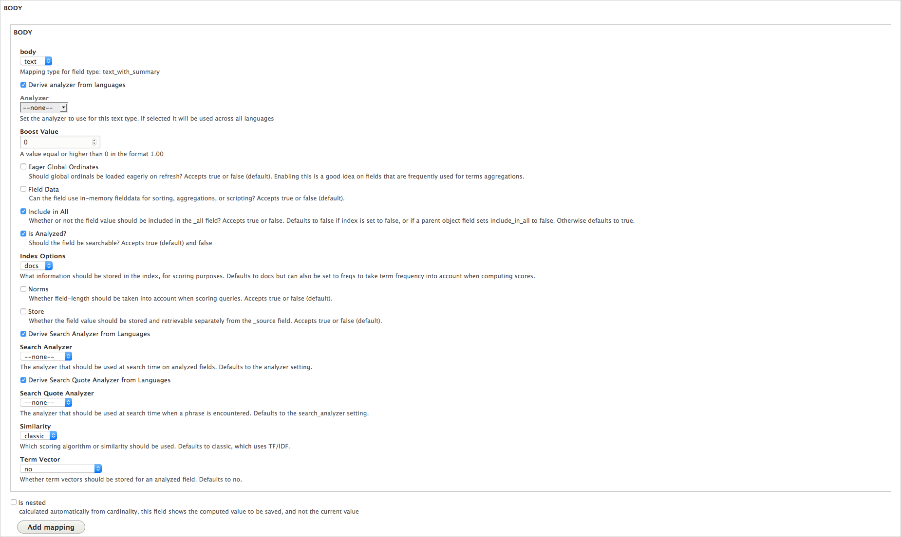
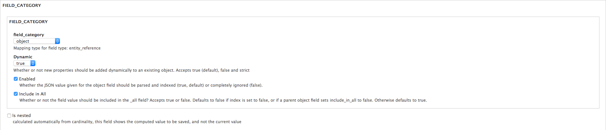
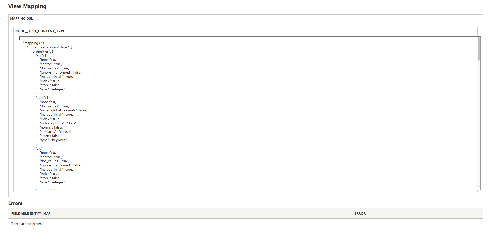

# Fieldable Entity Map (FEM) Configuration

Once your server is set up you will need to configure your entity maps. Fieldable entity maps (FEM's) form the basic definitions that elastic search mappings are built from, and allow you to specify to the leastic_search module exactly how it should represent your entities.
As previously discussed elastic_search likes to inline referenced documents, and this means that each of the entities you wish to map, including those mapped inline must be configured by elastic_search. This may involve a great number of entities/nodes/taxonomies/etc..... and as such the elastic_search module has functionality to help you auto generate the FEM entities for all maps that you will need.

Because elastic has no concept of many to one relationships (see [this blog post](https://www.elastic.co/blog/managing-relations-inside-elasticsearch)) Entity References do not play nicely with elasticsearch out of the box, and do not allow us to get the best out of its search capabilities
Therefore the elastic search plugin comes with an option to map referenced documents inside their parent document directly.

This has some important implications.

* All entity referenced types must have a separate elastic mapping
* Updating an entity will cause a search for that entity in your index, and a replacement of ALL occurrences of it in the index
* Additional storage will be consumed

A number of settings affect the way that this is handled in your index

* Recursion Depth
    Below the maximum recursion depth the document will be inlined into the parent, above this depth it will be a simple id value. This allows deep nestings and can be used to stop circular references
* Child Only
    If the document is set to child only on the server it will not get it's own index(or indices) and the field settings will only be used when inlining the entity type into the parent (if within the max recursion depth)

Be aware that if a FEM is changed the resultant mapping changes will need to be pushed to the server, this involves deleting and re-indexing the affected index data, which can be time consuming if you have a lot of recursion depth or references in your documents.

## Configuring FEMs

To configure an entity you would do as follows:

Visit the FEM configuration page /admin/config/search/elastic/fem

On this page you will see the existing maps and some options to create new maps. Click the 'Map Generator' button. This will open the map generator options.

In this instance we will select the node entity type and a test node type "test_content_type". After clicking "Submit" the FEM entities will be created for you, which you can now customize.

As you can see this has created some new maps for both our test content type and a taxonomy term that it references. Now that we have these skeleton entities we can visit them and configure the field mapping for elastic search.

Clicking the node__test_content_type FEM edit button we can see the mapping screen.

On this screen we can see all of the fields of the entity (including fields added by the system), as well as some additional options which we may configure.

## General Options

#### Active
If true this content will be sent to elastic_search

#### Child Only
If true then no index will be created for this entity and the mapping settings will only be used when merging a document of this type into another document

#### Simple References
If true then all references in this entity will be linked in a 'simple' way, and not flattened into the current document. Simple references store the linked content type by id (nid/tid/etc....) and as such the actual field data is not sent to elastic, to use simple references you will need to implement your own logic to retrieve or search the fields later.

#### Recursion Depth
Referenced entities below the recursion depth will not be merged into the current document, this allows us to merge the most important details, but leave deeply nested children or circular references out.
For example:

Entity Type A references Entity Type B
Entity Type B references Entity Type C and Entity Type A
Entity Type C references Entity Type D
Entity Type D references Entity Type E, Both D and E are set to child only

Entity Type A has a recursion depth of 1 so documents of Type B will be merged into Document A at index time. Merged documents of Type B will have references to entities of Type C and A stored as simple references.
Entity Type B has a recursion depth of 1 so documents of Types A and C will be merged in to document B at index time. Merged documents of Type A will have references to entities of Type B stored as simple references.
Entity Type C had a recursion depth of 2 so documents of Type D will be merged in to Document C at index time. Merged documents of Type D will have references to entities of Type E merged fully inline with their content.
Entity Types D and E will have no indices as they are marked as child only.

#### Dynamic Mapping

All field mapping options below are ignored and elastic is told to deal with the field data as it see's fit.

## Field Options

Each field has it's own set of mapping options depending on the field type. All default Drupal field types are covered by the elastic_search plugin. For custom fields you will need to add a plugin to register it with the module.
See the [developer documentation](../developer/README.md) for information on how to do this.

The options you will see presented for each field will map to the elastic field type you have chosen, these currently cover all of the inbuilt elastic_search field datatypes, [which can be found here](https://www.elastic.co/guide/en/elasticsearch/reference/current/mapping-types.html).
It is advisible to check the Elastic documentation when configuring your fields to fully understand the implication of each option

It is also worth pointing out the 'Object' Mapping

Object mappings refer to an external FEM object which describes the configuration of the fields, therefore to configure an object you must go to the FEM of the entity, and configure the fields there, these settings will then be used to build the final map.

## View Map Dsl

Hitting "View Map DSL" will attempt to render the mapping for the currently selected FEM and report if any errors exist.
NOTE: YOU MUST SAVE YOUR FEM BEFORE USING THIS OPTION OR CHANGES WILL BE LOST

This will show you the exact DSL as it will be sent to elastic_search (minus dynamically added language analysers, which are added at the Index level), and a table of any errors (missing FEM's or incorrect config).
This can be used to check that the mapping is as you expect, or later to check that the mapping returned by the server matches the mapping you configured in Drupal (comparison done manually currently)