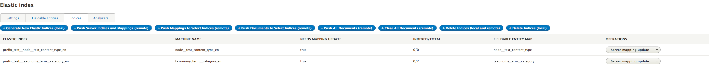

# Index Generation

Now that your FEM's for your entity are generated you can use them to create Indices and push the mappings to the server. To do this visit the Indices Page /admin/config/search/elastic/index

The index page has a number of buttons on it to expose common tasks, or offer bulk processes for time consuming jobs. Each of these buttons expresses where the action is performed via the bracketed text.

We can use these to generate Indices for the FEM's that we created.

## Header Buttons

### Generate New Elastic Indices (local)

This button generates the Indices that are described by your FEM's. This will generate an index per language for all none 'Child Only' FEM's and will produce an output similar to the following in a single language site:

### Push Server Indices and Mappings (remote)

Pushes ALL mapping and indices to the server. This does not push any documents, it simply ensures that the correctly named indices and mappings are present

### Push Mappings to Select Indices (remote)

Push mappings for only select indices to the server, this allows for partial updates of indices where appropriate (ie push all languages for entity type x)

### Push All Documents (remote)

Push data for all documents to all indices.

### Push Documents to Select Indices

Only push documents to a select set of indices, this allows for partial document updates after content type mapping changes

### Clear all documents

Delete all documents from all Indices on the elastic server.

### Delete Indices (Local and Remote)

Delete all elastic indices on the remote server and delete all index entities in the local drupal install

### Delete Indices (local)

Only delete local Index entities.

## Elastic Index Table

A brief description of the Elastic Index table columns.

### Elastic Index Name

The Index name is the name that is used on the Elastic server to store the documents in and is built using the following pattern:
`{prefix}_{entity_type}__{entity_bundle}_{langcode}` or `{prefix}_{index_machine_name}`
If you need to find this ID programatically you should look at the static methods on the ElasticIndex class.

### Machine Name

The machine name of the local entity, this is built using the following pattern
`{entity_type}__{entity_bundle}_{langcode}`

### Needs Mapping Update

If the FEM entity is changed locally, or the Prefix is changed then this field will be marked as TRUE, and a mapping update will need to be performed to mark it as false.

### Indexed/Total

The total number of indexed documents on the server for this Index compared to the total number of local documents.

### Fieldable Entity Map

The machine name of the FEM to which this Index refers

### Operations

The operations dropdown allows the user to perform a number of actions against this individual index (compared to the buttons at the top which work on all or selected indices)

#### Server Mapping Update

Push the current mapping to the server. If an existing mapping for this type exists it will be deleted along with all indexed documents

#### Server Document Update

Push all documents to the server. This will push them immediately rather than queue

#### Server Document Clear

Delete all documents in the index on the server

#### Delete

Deletes the local Index object, performs no action on the remote Index

#### Delete Remote

Deletes only the remote Index, performs no action on the local Index entity

#### Edit

Edit the Index entity. This allows explicit custom configuration to be added for this elastic index, such as the id seperator or index language. It is not normally necessary or advisable to edit these settings manually.

