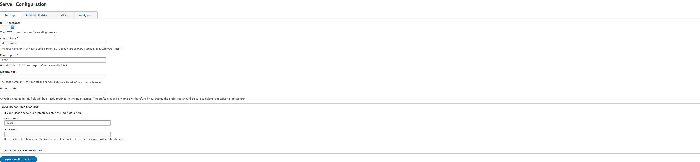
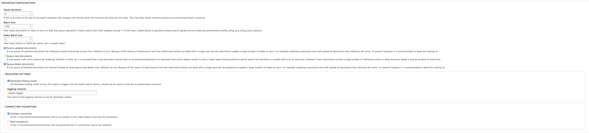

# Server Configuration

The first thing you will need to do is configure your elastic_search server settings. These are all the details needed to connect to your server so that mappings and documents can be pushed.

## General Settings

### Http Protocol

Do you connect to elastic via http or https. https is recommended

### Elastic Host

This will usually be the URL of the service. If you are using a docker based setup it may however be the SERVICE NAME of the elastic container (as per the above example)

### Elastic Port

For http the standard is 9200, for https it is 9243

### Kibana Host

Currently does nothing [(See Roadmap)](../ROADMAP.md)

### Index Prefix

One of the most important fields on this config form is the index prefix field. It is important to note that this id is dynamic, and it added to the index identifier at mapping/index time.
Changing this will not directly alter your local or remote indices entities but will mark them as needing an update on the server due to the new naming. It is important to note that changing this value is functionally equivalent to
deleting all your indices (even though they are not deleted remotely) as all mappings and content will need to be pushed again. This is primarily used to share the same elastic instance between environments via prefixing.

## Advanced Settings

Advanced settings allow you to specify some additional debug information to help track down potential issues with your elastic_search configuration or usage as well as configuring some more technical options.

#### Pause Duration
Insert a pause between bulk actions on the elastic server. This can be useful to allow a small break for the server to process the last document upload, helps in environments with tightly constrained resources.

#### Batch Size
How many items to process per batch operation, this needs to be tuned between the insert size in the drupal database and the elastic server. Elastic works best with less requests, each containing a large amount of data, with 5-15mb of data being ideal. However as this data must be queued in drupal your database table insert size may prevent this.

#### Index Batch Size
How many indices should be mapped/pushed per batch, usually 1 is appropriate.

#### Queue Updated Documents
As elastic_search flattens documents down a single update can in theory affect a lot of other documents (all documents that it references) and this lengthy process is likely to cause timeouts if processed directly at entity save time. Therefore document updates can be added to the queue table for processing via Cron

#### Queue New Documents
As a new document will not be reference in other documents it is usually safe to leave this option off as it will not cause timeouts

#### Queue Deleted Documents
Similarly to updated documents deleting something has the potential to affect a lot of other documents into which it is merged, therefore by default these items are queued for deletion.

### Developer Settings

The developer settings allow you to inject logging in to the elastic search php library if enabled. It is strongly advised NOT to enable this on production due to performance issues

### Connection Validation

If connection validation is switched on the connection to elastic will be tested for correctness before use, with the additional option of a 'hard' fail (exception thrown). It is strongly advisable not to enable either of these options on production sites for better speed and user experience.

