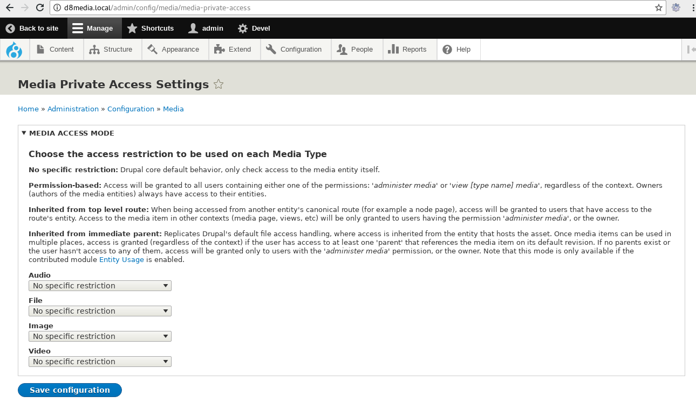
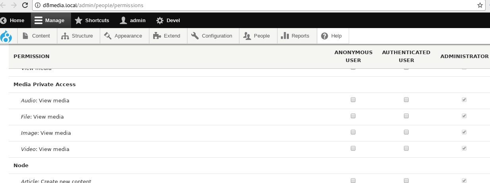

# Media Private Access

## Overview

This project is intended to explore ways of improving the access handling of
private media assets.

As shown in some [recent](https://drupal.org/node/2904842)
 [issues](https://drupal.org/node/2937642), users may expect from media assets
 the same behavior that Drupal core provides when handling access to private
 files.

This is not the case, and this project exposes some tools to site
 administrators allowing them to deal with some of the affected scenarios.

## Early-development disclaimer

This project is in a very early development stage. You should not use it in
production without performing your own code review first, and testing that it
suits your site's needs as expected.

## Installation & Usage

After enabling this module, you will have the ability to configure the access
mode to be used for each of your Media types. Navigate to "Configuration ->
Media -> Media Private Access Settings" (or go to
`/admin/config/media/media-private-access` ), and configure your options there.

**IMPORTANT**: All access modes share some assumptions:
- **Only "view" operations are affected**. For all other operations (update,
 delete, etc), access checks are delegated to the default Drupal's access
 handler and this module does not alters them in any way.
- **Administrators can access all media**. Regardless of the access mode
 selected, users with the "*administer media*" permission will always be granted
 view access to media entities of that type.
- **Owners can always view their own media**. Regardless of the access mode
 selected, users that author media items will always be able to view their own
 entities.
- **Non-configured media types will be left unaltered.** This module will do
 nothing by default. Access checks will only be affected on Media types that
 were explicitly configured on the settings page to use an access mode. Make
 sure you configure the access mode after creating a Media type, otherwise the
 standard behavior (Drupal's original access handler) will be used.

If any of these assumptions does not fit your use case, please report it on the
issue queue, and we can discuss together if it makes sense to modify them in a
generic way.

### "Permission-based" access mode

When this mode is selected, view access will be granted to all users with the
"*view [type name] media*" permission. This is a new permission generated by
this module, specific per Media type:

When using this access mode, this permission is checked in all contexts where
the media item can be accessed (standalone page, embedded into another entity,
views results, etc.).

### "Inherited from top level route" access mode

This access mode disallows view access to non-owners and non-administrators to
all media items in "standalone" contexts. This includes the media detail page
( `/media/{media_id}` ), as well as all rendering contexts where there isn't a
top-level entity to delegate the access into. For example, views results will
likely not show entities to non-admins / non-owners.

When the media item is used in the context of another entity (for example as a
referenced item in a node field, or embedded into a formatted text field), the
top-level route will be checked and access to the media item will be granted if
the user can access the top-level route.

### "Inherited from immediate parent" access mode

This is the most flexible scenario, and replicates Drupal's standard private
filesystem access handling. View access to non-admins / non-owners will be
inherited from the immediate parent, regardless of the rendering context.

Once media items can be referenced from multiple places, the "immediate parent"
entity can be several different ones. Access to the media item (in any context)
will be granted if **any** of the "parents", on their default revision, grant
access to the current user.

Note that when using this access mode, Media items that are not referenced from
any other entities (i.e. without "parents"), will only be accessible to
administrators and owners.

This access mode is only available if the contrib module
[Entity Usage](https://drupal.org/project/entity_usage) is enabled on the site.

### No configuration

As mentioned above, all Media types need to be explicitly configured to use one
of the access modes available. Non-configured types will use Drupal's default
access handler, granting view access to all users with permission
"*view media*".

## Feedback wanted

Please provide feedback about this module on the issue queue.
