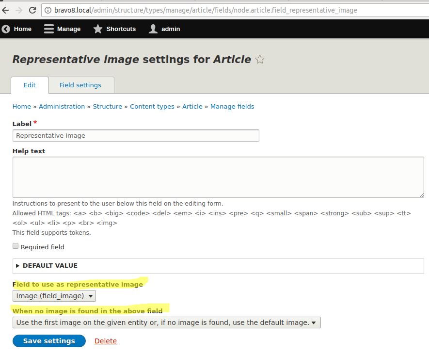
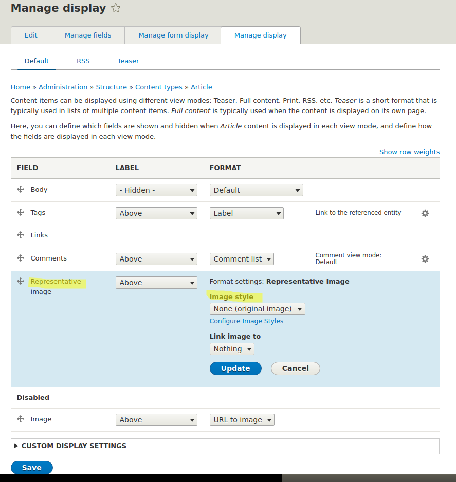
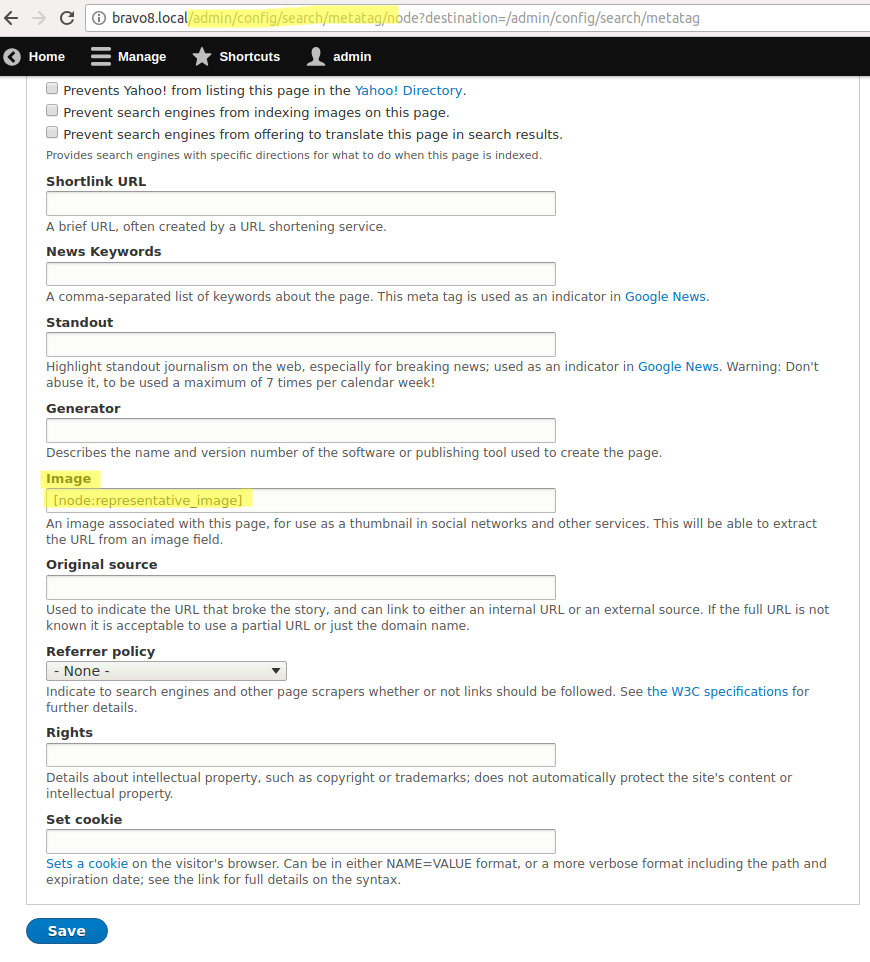
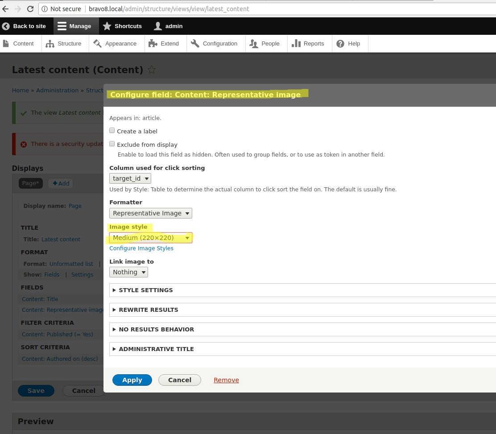

Representative Image allows you to define a field for each entity bundle that
should be referenced to display an image when a representative image for an
entity is requested.

This module has been built to work with any entity type that is fieldable,
although it has only been tested with node content types.

# Installation and configuration

Install the module via the command line or the web interface. Next, add a
Representative Image field to a content type and adjust the following settings:

Add the already existing field to other content types and define what image
field should be used and what to do if it is empty in each of them.

# Usage

With the above in place, you can:

## Use the field it in display modes

Select an image style and link type and let the field decide which image to use:

## Use a token for social networks

The token will transform into the full URL of an image:

## Use the field in views

In a view with multiple content types, add the field and select an image style for it:

