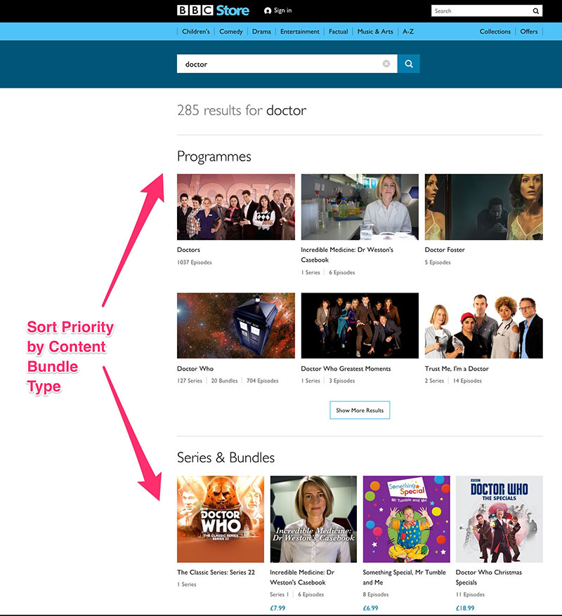

# Search API Sort Priority

This module allows site admins to configure custom sort priority for 
Search API Results. There are a number of Search API processors that 
allow a configurable weights.

## Search API Processors
### Sort priority by Content Bundle
If you have a website with multiple Content Bundles and you would like
 to sort the results by assigning arbitrary priority to each bundle type.

This filter allows sorting of search results by weight assigned to each
 Content Bundle.

Example: Sort results in the following priority order:
* News
* Article
* Basic Page

### Sort Priority by Role
This processor allows Roles to be assigned weights, so allows the 
possibility to sort content by "Admin" role higher than "Editor".

Example: Sort results in the following Role priority order:
* Admin
* Editor
* Member

### Sort Priority by Media Bundle
If you have a website with multiple Media Bundles and you would like 
to sort the results by assigning arbitrary priority to each bundle type.

This filter allows sorting of search results by weight assigned to each 
Media Bundle.

Example: Sort results in the following priority order:
* Flickr
* Facebook
* Instagram

### Sort Priority by Paragraph Bundle
If you have a website with multiple Paragraph Bundles and you would like 
to sort the results by assigning arbitrary priority to each bundle type.

This filter allows sorting of search results by weight assigned to each 
Paragraph Bundle.

Example: Sort results in the following priority order:
* Attached File	
* Inset text
* Hero Image

## Project Code

* GitHub
[search_api_sort_priority](https://github.com/dakkusingh/search_api_sort_priority)

* Drupal.org
[search_api_sort_priority](https://www.drupal.org/project/search_api_sort_priority)
