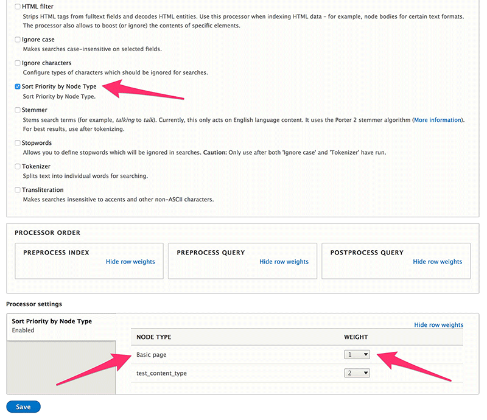
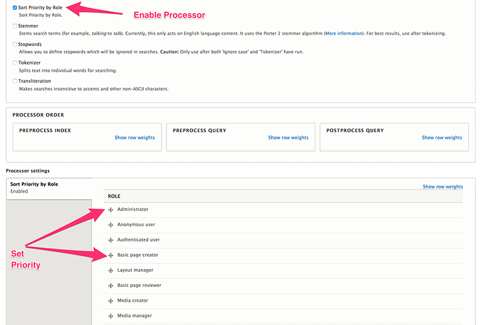
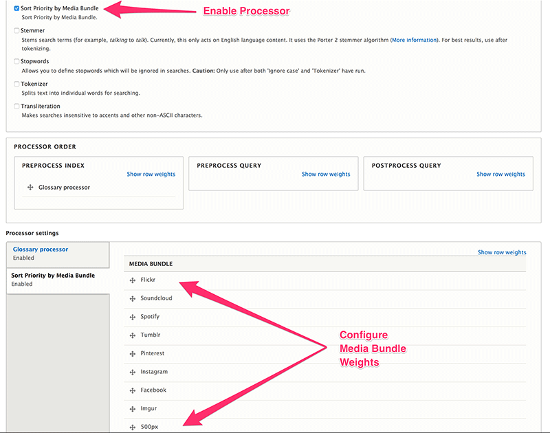

# Search API Sort Priority
## Usage Guide

### Content Bundle Processor
#### 1: Enable the Sort Priority by Content Bundle Processor

#### 2: Save the processor
This will create all the required fields and you are ready to go.

#### 3: New weight field
A new field named *search_api_contentbundle_weight* is ready for you to add to 
views, or use as you see fit. This field contains the weight assigned to 
Content Bundles.

### Role Processor
#### 1: Enable the Sort Priority by Role Processor

#### 2: Save the processor
This will create all the required fields and you are ready to go.

#### 3: New weight field
A new field named *search_api_role_weight* is ready for you to add to views, or
 use as you see fit. This field contains the weight assigned to Roles.

### Media Bundle Processor
#### 1: Enable the Sort Priority by Media Bundle Processor

#### 2: Save the processor
This will create all the required fields and you are ready to go.

#### 3: New weight field
A new field named *search_api_mediabundle_weight* is ready for you to add to 
views, or use as you see fit. This field contains the weight assigned to Media 
Bundles.
