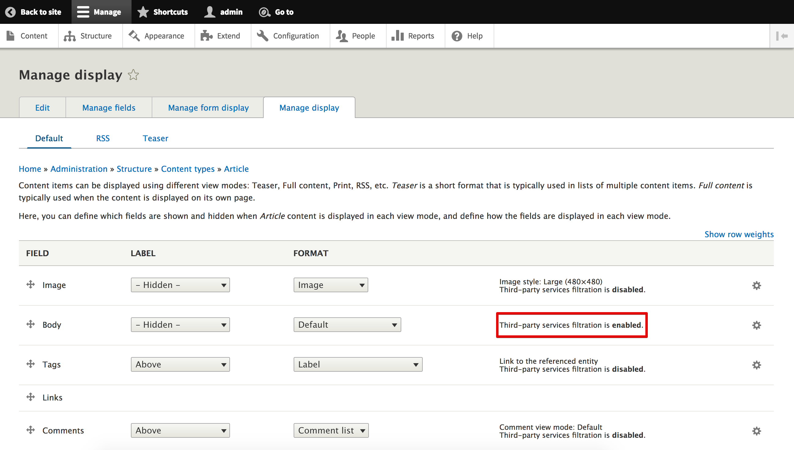
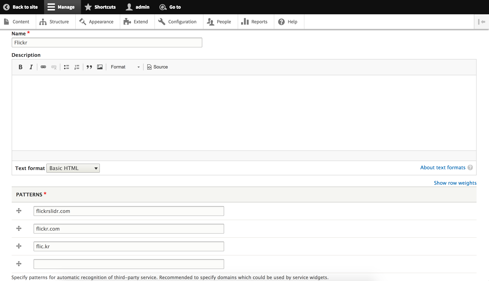
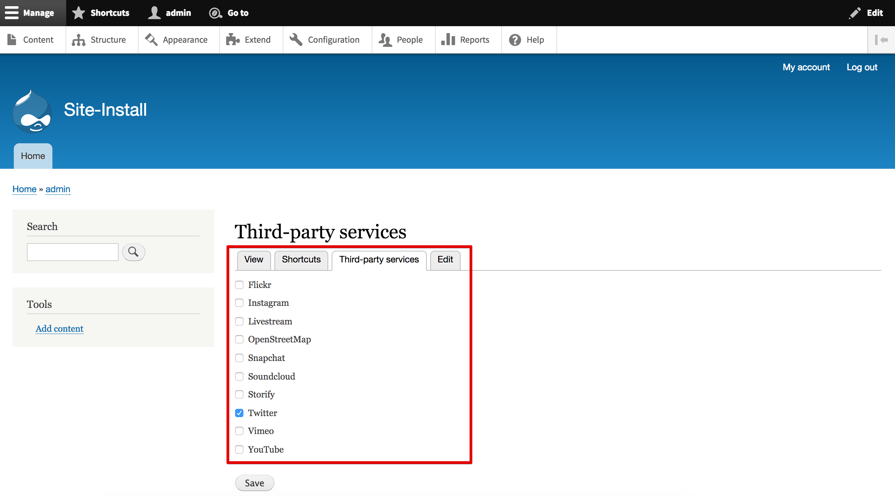
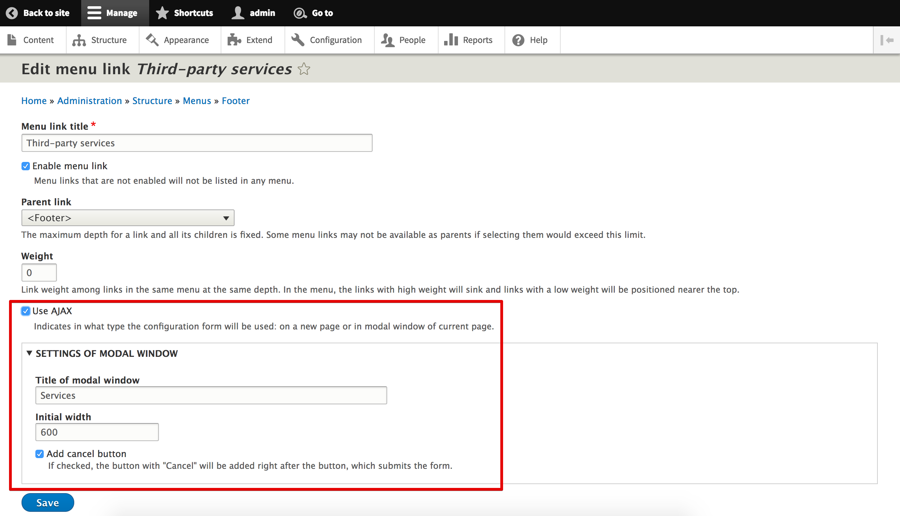

# Third-party Services

Respect people privacy and let every particular user to decide which external services to be rendered on your pages.

The implementation is frontend-based, so you can safely use this project alongside with caching services, like Varnish or Nginx.

## How to use

The main idea of implementation - to process fields and blocks and check their contents for external widgets. How this achieved?

### Fields



Third-party services filtering might be enabled for every field.

### Blocks

```php
namespace Drupal\MODULE\Plugin\Block;

use Drupal\Core\Block\BlockBase;

/**
 * @Block(
 *   id = "twitter_block",
 *   admin_label = @Translation("Twitter block"),
 *   category = @Translation("Social widgets"),
 * )
 */
class TwitterBlock extends BlockBase {
  public function build() {
    $build = [];
    $build['content'] = [
      '#markup' => '<a class="twitter-timeline" href="https://twitter.com/TwitterDev/timelines/539487832448843776">National Park Tweets - Curated tweets by TwitterDev</a> <script async src="//platform.twitter.com/widgets.js" charset="utf-8"></script>',
    ];

    \Drupal::service('third_party_services.block_optional_render')->process($build, $this);

    return $build;
  }
}
```

Must be called manually and programmatically due to only you knows which blocks have to be processed.

## What the module provides?

### Taxonomy vocabulary



The `Third-party services` taxonomy vocabulary is a collection of terms, representing third-party services. Every term has `Patterns` field which should list all possible patterns for markup recognition of third-party service. The following services are provided out of the box: `Flickr`, `Instagram`, `Livestream`, `OpenStreetMap`, `Snapchat`, `Soundcloud`, `Storify`, `Twitter`, `Vimeo`, `YouTube`. Checkout out the implementation of `third_party_services_install()` to understand how to fill the vocabulary programmatically.

### Configuration form



Configuration form is available even for anonymous users (settings are stored in [localStorage](https://developer.mozilla.org/en/docs/Web/API/Window/localStorage)) and lists terms from vocabulary as options to select.

### Menu link



By default link is placed into `Footer` menu (you can change this) and has additional settings for modal window, in which configuration form will be opened (if AJAX enabled, otherwise user will proceed to configuration page).

### Templates

Module ships with basic templates for the configuration form and placeholder to show instead of third-party service, which is blocked. You can redefine them in your theme and tweak by desire.

### Twig function

`third_party_services__configuration_form_url` - function can take as much as needed options to configure modal dialog displaying. For now, available options are: `dialogClass`, `addCancelButton` and all from http://api.jqueryui.com/dialog.

Example:

```twig
<a href="{{ third_party_services__configuration_form_url({width: 600, title: 'Test', addCancelButton: 1}) }}" class="button use-ajax">
  {{ 'Provide data protection settings'|t }}
</a>
```

### RawHtmlRenderer service

The `third_party_services.raw_html_renderer` service may be helpful in case when you need to render standalone block of HTML with styles, scripts and settings included.

### LocalStorage AJAX command

Communicate with localStorage from backend.

```php
$response->addCommand(new LocalStorageCommand('setItem', 'key', 'value'));
```

```javascript
localStorage.getItem('key') === 'value'
```

### LocationReload AJAX command

Reload current page from JS.

```php
$response->addCommand(new LocationReloadCommand());
```

## Demonstration

https://www.youtube.com/watch?v=gSk8KUxtZs4
